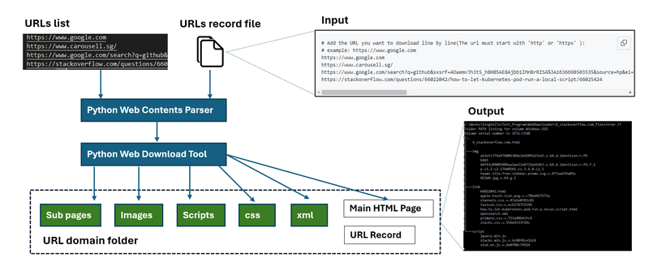

# Web Downloader

**Program Design Purpose**: We want to scrape and download all the components (.html, .css, img, xml, video, javascript ...) for several batch of webpages based on a list of URLs.


#### Introduction 

This module will provide API to download the webpage components :  html file, image file, css file,  xml file javascript file, href link file based on the input url (the url must start with 'http' or 'https' ). 

To prosses multiple URLs at the same time, The user can list all the URLs he wants to download  in the file "urllist.txt" as shown below (line start with char '#' will be treated as comments and ignored): 

```
# Add the URL you want to download line by line(The url must start with 'http' or 'https' ):
# example: https://www.google.com
https://www.google.com
https://www.carousell.sg/
https://www.google.com/search?q=github&sxsrf=AOaemvJh3t5_h8H85AE8Ajbb1IMnBrRISA%3A1636698503535&source=hp&ei=hwmOYY6mHdGkqtsPq8S9sAY&iflsig=ALs-wAMAAAAAYY4Xl7GLWS16_xc2Q9XrG0p3q277DpkL&oq=&gs_lcp=Cgdnd3Mtd2l6EAEYADIHCCMQ6gIQJzIHCCMQ6gIQJzIHCCMQ6gIQJzIHCCMQ6gIQJzIHCCMQ6gIQJzIHCCMQ6gIQJzINCC4QxwEQowIQ6gIQJzIHCCMQ6gIQJzIHCCMQ6gIQJzIHCCMQ6gIQJ1AAWABgjgdoAXAAeACAAQCIAQCSAQCYAQCwAQo&sclient=gws-wiz
https://stackoverflow.com/questions/66022042/how-to-let-kubernetes-pod-run-a-local-script/66025424
```

###### Program Workflow



Version: v_0.1


------

#### Program Setup

###### Development Environment : python 3.7.4

###### Additional Lib/Software Need

1. **beautifulsoup4 4.10.0**

   install:

   ```
   pip install beautifulsoup4
   ```

   Lib link: https://pypi.org/project/beautifulsoup4/

2. 

###### Hardware Needed : None

###### Program File List 

version: v0.1

| Program File   | Execution Env | Description                          |
| -------------- | ------------- | ------------------------------------ |
| webDownload.py | python 3      | Main executable program use the API. |
| urllist.txt    |               | url record list.                     |


------

#### Program Usage

###### Module API Usage

1. WebDownloader init: 

```
obj = urlDownloader(imgFlg=True, linkFlg=True, scriptFlg=True)
```

- **imgFlg**: Set to "True" to download all the "img" tag files. 
- **linkFlg**: Set to "True" to download all the html section, image, icon, css file imported by  "href".
- **scriptFlg**: set to "True" to download  all the js file. 

2. Call API method savePage to scape url and save the data in a folder 

   ```
   obj.savePage('<url>', '<folder_name>')
   
   # Exampe:
   obj.savePage('https://www.google.com', 'www_google_com')
   ```

3.  --


###### Program Execution 

1. Copy the URLs you want to check in the URLs record file "**urllist.txt**"

2. Cd to the program folder and run program execution cmd: 

   ```
   python webDownload.py
   ```

3. Check the result: 

   For example, if you copy the url "https://www.carousell.sg/" as the first url you want to check into the file "urllist.txt" file, all the html files, image file and js files will be under folder "**`1_www.carousell.sg_files`**"

   - The main web page will be saved as:  "`1_www.carousell.sg_files/1_www.carousell.sg.html`"
   - The image used in the page will be saved in folder: "`1_www.carousell.sg_files/img`"
   - The html/imge/css import by href will be saved in folder: "`1_www.carousell.sg_files/link`"
   - The js file used by the page will be saved in folder: "`1_www.carousell.sg_files/script`"
   - The url https://www.carousell.sg/ string will be saved in the file `1_www.carousell.sg_files/Info.txt`.


------

#### Problem and Solution

###### **Problem**[0]: Files download got slight different with browser direct download.

Why there is a slight different between the files which are downloaded by the program and the files which download I use some-webBrowser's "page save as " for the same URL such as www.google.com ? 

**OS Platform** : n.a

**Error Message**: n.a

**Type**: n.a

**Solution**:

This is normal situation, the logic of web scrape and browser display are different: If you type www.google.ccom in different people's browser, you can see the page shown on different browser are also different. This is because the browser cache, cookies, and local storage token in the browser's local storage ,such as cookie will make influence of the "GET" request. So when different people type in the google URL in their browser, they will see their own Gmail head icon shows on the right top corner of the page. If you remove all the cache, token in the browser's local storage , clean the related cookies of your browser and try "page save as ", the file downloaded by  "page save as " should be same as the program. 


###### **Problem**[2]: Some download image are empty or can not open

**OS Platform** : n.a

**Error Message**: n.a

**Type**: n.a

**Solution**:

If a web use third party's storage to save the image and the net-storage need to authorization before download, our program download request will be rejected and got 'null' when download the image file. Then the saved image will be empty. 


------

> Last edit by LiuYuancheng(liu_yuan_cheng@hotmail.com) at 30/11/2021

