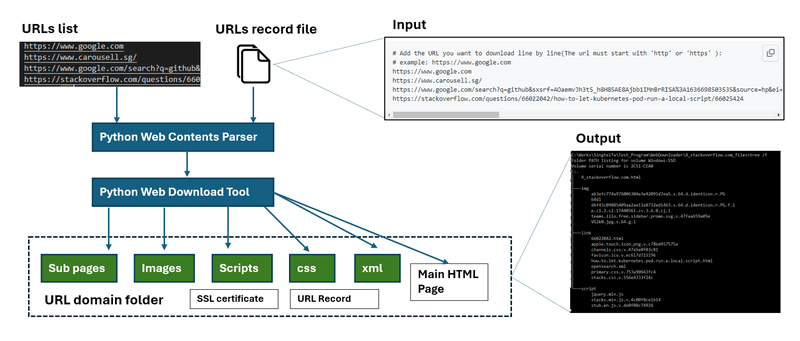
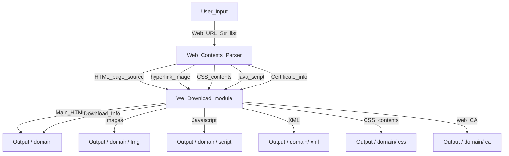
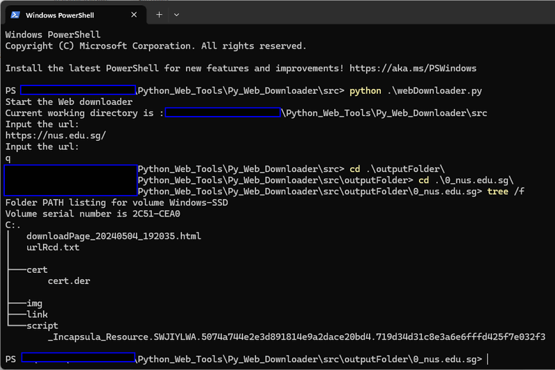

# Python Web Contents Download Tool

**Program Design Purpose**: Our goal is to develop a Python library tailored for big data projects, specifically designed for data collection purposes. This library will facilitate the scraping and downloading of all components associated with multiple batches of webpages, including `.html` files, `.css` stylesheets, `images`, `XML` files, `videos`, `JavaScript` files, and host `SSL certificates`, based on a provided list of URLs.

The program workflow is depicted below:

` Figure-00: Python_web_contents_download_tool_workflow_diagram, version v0.1.2 (2024)`

The library will download the web main html contents first then use python beautifulsoup lib to parse all the contents from the web html file source to get the linked html, image, java script, css then download the contents one by one and save in the related local folder.  It will provide a flexible API that allows integration with other programs seamlessly.

```
# Created:     2021/11/12
# Version:     v_0.1.2
# Copyright:   Copyright (c) 2024 LiuYuancheng
# License:     MIT License 
```

**Table of Contents**

[TOC]

- [Python Web Contents Download Tool](#python-web-contents-download-tool)
    + [Introduction](#introduction)
    + [Program Setup](#program-setup)
        * [Development Environment : python 3.7.4](#development-environment---python-374)
        * [Additional Lib/Software Need](#additional-lib-software-need)
        * [Hardware Needed : None](#hardware-needed---none)
        * [Program File List](#program-file-list)
    + [Program Usage](#program-usage)
      - [Program Execution](#program-execution)
      - [Module API Usage](#module-api-usage)
      - [Problem and Solution](#problem-and-solution)

------

### Introduction 

This module offers an API for downloading various components of webpages, including HTML files, images, CSS files, XML files, JavaScript files, and hyperlink links, based on input URLs (which must begin with 'http' or 'https'). The module's input and output flow is represented in the diagram below:



To process multiple URLs simultaneously, users can list all the URLs they wish to download in the file "*urllist.txt*", as shown below (lines starting with '#' will be treated as comments and ignored):

```
# Add the URL you want to download line by line(The url must start with 'http' or 'https' ):
# example: https://www.google.com
https://www.google.com
https://www.carousell.sg/
https://www.google.com/search?q=github&sxsrf=AOaemvJh3t5_h8H85AE8Ajbb1IMnBrRISA%3A1636698503535&source=hp&ei=hwmOYY6mHdGkqtsPq8S9sAY&iflsig=ALs-wAMAAAAAYY4Xl7GLWS16_xc2Q9XrG0p3q277DpkL&oq=&gs_lcp=Cgdnd3Mtd2l6EAEYADIHCCMQ6gIQJzIHCCMQ6gIQJzIHCCMQ6gIQJzIHCCMQ6gIQJzIHCCMQ6gIQJzIHCCMQ6gIQJzINCC4QxwEQowIQ6gIQJzIHCCMQ6gIQJzIHCCMQ6gIQJzIHCCMQ6gIQJ1AAWABgjgdoAXAAeACAAQCIAQCSAQCYAQCwAQo&sclient=gws-wiz
https://stackoverflow.com/questions/66022042/how-to-let-kubernetes-pod-run-a-local-script/66025424
```

Afterward, execute the test case program `testCase.py`, and the captured screenshots will be saved in the output folder `outputFolder`.


------

### Program Setup

##### Development Environment : python 3.7.4

##### Additional Lib/Software Need

1. **beautifulsoup4 4.10.0**: https://pypi.org/project/beautifulsoup4/

   ```
   Installation cmd: pip install beautifulsoup4
   ```
   
2. **Python SSL lib**: https://pypi.org/project/ssl/

   ```
   Installation cmd: pip install ssl
   ```


##### Hardware Needed : None

##### Program File List 

| Program File   | Execution Env | Description                          |
| -------------- | ------------- | ------------------------------------ |
| webDownload.py | python 3      | Main executable program use the API. |
| testCase.py    | python 3.7+   | Test case program and usage example. |
| urllist.txt    |               | url record list.                     |


------

### Program Usage


#### Program Execution 

Users have two options for executing the program: processing URLs individually or batch processing multiple URLs. 

**Use Console Interface** 

To process URLs individually, users can run the program directly and follow the steps provided:

```
python webDownload.py
```



` Figure-1: Python_web_download_tool_execution, version v0.1.2 (2024)`

**Batches Process URL with Record File** 

1. Prepare a list of URLs to be processed by copying them into the URL record file "**urllist.txt**".

2. Navigate to the program folder and execute the program using the following command:

```
python testCase.py
```

3. Check the result: 

For example, if you copy the url "https://www.carousell.sg/" as the first url you want to check into the file "urllist.txt" file, all the html files, image file and js files will be under folder "`1_www.carousell.sg_files`"

- The main web page will be saved as:  "`1_www.carousell.sg_files/1_www.carousell.sg.html`"
- The image used in the page will be saved in folder: "`1_www.carousell.sg_files/img`"
- The html/imge/css import by href will be saved in folder: "`1_www.carousell.sg_files/link`"
- The js file used by the page will be saved in folder: "`1_www.carousell.sg_files/script`"
- The url https://www.carousell.sg/ string will be saved in the file `1_www.carousell.sg_files/Info.txt`.
- The certificate of host www.carousell will be download as file `1_www.carousell.sg_files/cert/cert.der`.


#### Module API Usage

1. WebDownloader init: 

```
obj = webDownloader.webDownloader(imgFlg=True, linkFlg=True, scriptFlg=True, caFlg=True)
```

- **imgFlg**: Set to "True" to download all the "img" tag files. 
- **linkFlg**: Set to "True" to download all the html section, image, icon, css file imported by  "href".
- **scriptFlg**: set to "True" to download  all the js file. 
- **caFlg**: set to "True" to download the host SSL certificate. 

2. Call API method savePage to scape url and save the data in a folder 

   ```
   obj.savePage('<url>', '<folder_name>')
   
   # Exampe:
   obj.downloadWebContents('https://www.google.com', 'www_google_com')
   ```


> For detail API usage, please refer to document [Lib_api_doc.html](Lib_api_doc.html)


------

#### Problem and Solution

##### Problem[0]: Files download got slight different with browser direct download.

Why there is a slight different between the files which are downloaded by the program and the files which download I use some-webBrowser's "page save as " for the same URL such as www.google.com ? 

**OS Platform** : n.a

**Error Message**: n.a

**Type**: n.a

**Solution**:

This is normal situation, the logic of web scrape and browser display are different: If you type www.google.ccom in different people's browser, you can see the page shown on different browser are also different. This is because the browser cache, cookies, and local storage token in the browser's local storage ,such as cookie will make influence of the "GET" request. So when different people type in the google URL in their browser, they will see their own Gmail head icon shows on the right top corner of the page. If you remove all the cache, token in the browser's local storage , clean the related cookies of your browser and try "page save as ", the file downloaded by  "page save as " should be same as the program. 


##### Problem[2]: Some download image are empty or can not open

**OS Platform** : n.a

**Error Message**: n.a

**Type**: n.a

**Solution**:

If a web use third party's storage to save the image and the net-storage need to authorization before download, our program download request will be rejected and got 'null' when download the image file. Then the saved image will be empty. 


------

> Last edit by LiuYuancheng(liu_yuan_cheng@hotmail.com) at 04/05/2024, if you have any problem, please send me a message. 

